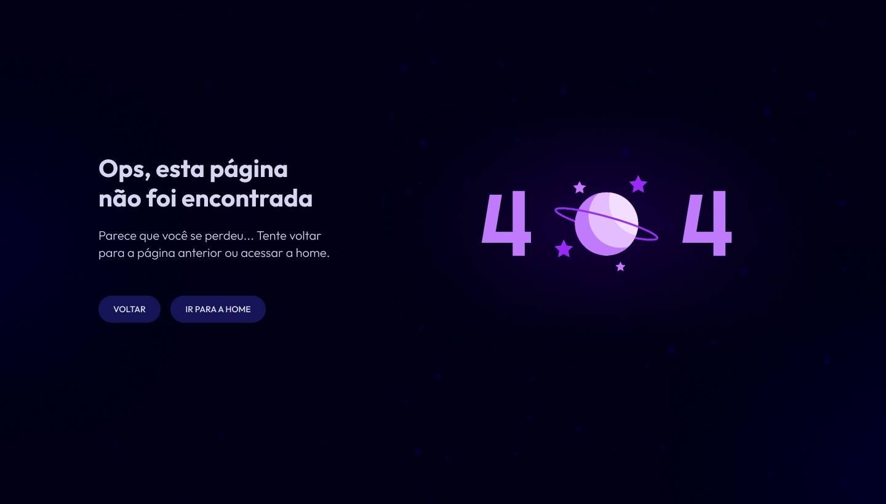

<h1 align="center"> PÁGINA NÃO ENCONTRADA 404 </h1>

	página de erro 404 (página não encontrada), com animação.

  <a href="#-tecnologias">Tecnologias</a>&nbsp;&nbsp;&nbsp;|&nbsp;&nbsp;&nbsp;
  <a href="#-projeto">Projeto</a>&nbsp;&nbsp;&nbsp;|&nbsp;&nbsp;&nbsp;
  <a href="#-destaques-do-aprendizado">Destaques do Aprendizado</a>&nbsp;&nbsp;&nbsp;|&nbsp;&nbsp;&nbsp;
  <a href="#-licença">Licença</a>
 

 

  

## 🚀 Tecnologias

Esse projeto foi desenvolvido com as seguintes tecnologias:

- HTML e CSS
- JavaScript
- Lottiefiles
- Git e Github
- Figma.

## 💻 Projeto

A Página Não Encontrada 404 é uma página de erro que informa ao usuário que a página solicitada não foi encontrada. A estilização e a animação proporcionam uma experiência visual agradável e interativa.

- [Acesse o projeto finalizado, online](https://juandasilvaa.github.io//)

## 🔍 Destaques do Aprendizado

- Animações com Lottiefiles: Aprendizado sobre como integrar e trabalhar com animações do Lottiefiles.
- Grid-template-columns no CSS: Implementação de layouts responsivos utilizando grid-template-columns.

## 📝 Licença

Este projeto faz parte do #boraCodar da Rocketseat, onde eles fornecem um design no Figma e você deve desenvolver. Para acessar a resolução da forma deles, é necessário ser assinante., [clique aqui](https://www.rocketseat.com.br/boracodar/desafios-anteriores/uma-pagina-de-erro-404-desafio-27).
